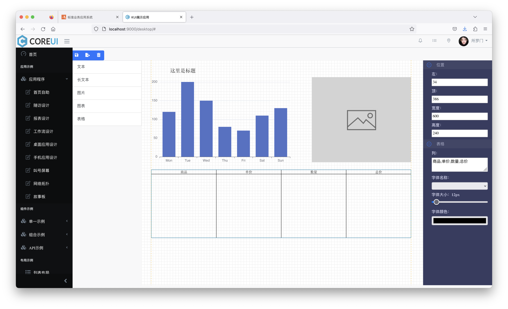

## Run node web server (Recommended)

```bash
npm run dev
```

## Build althttpd from Source

```bash
gcc server/althttpd.c -o bin/althttpd
```

## Run althttpd Web Server

```bash 
bin/start &
```

## Screenshots

### Topology


### Report Design


